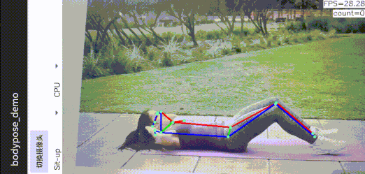

# sports_counting_by_pose_estimation
It is interesting to use pose estimation for sports counting. This project serves as a demo for this goal, which contains a whole pipeline of model conversion and ncnn Android deployment.

`Sit up` counting is supported now. It is easy to add other sports support.



Here is a demo result for Sit up counting.

## model conversion and preparation
`MoveNet` is used in this project. Google provides its pretrained model in tensorflow format. What I did to convert it to ncnn format is recorded as following.

1. Download the tflite model from tensorflow [model hub](https://tfhub.dev/google/lite-model/movenet/singlepose/lightning/3)

   - the Lightning version of `MoveNet` is used in this project because it is intended for latency-critical applications.

2. Convert tfllite model to ONNX model using [tensorflow-onnx](https://github.com/onnx/tensorflow-onnx)

   ```bash
   python -m tf2onnx.convert --tflite movenet.tflite --output movenet.onnx
   ```

3. Optimize the ONNX model using [onnx-simplifier](https://github.com/daquexian/onnx-simplifier)

   ```bash
   python -m onnxsim movenet.onnx sim_movenet.onnx
   ```
   
4. **Edit the optimized ONNX model**

   - This step is necessary because some of the post processing operators are not supported in ncnn.
   
   - What we need to do are:
     - Remove the pre-processing and post-processing operators.
       - They will be implemented in raw C++ 
       - tensorflow use `NHWC` format while ONNX use `NCHW` format. So the `Transpose` operators in pre-processing and post-processing operators should also be removed. 
     - rename the model input and output.
   
   - Then we get `modified_sim_movenet.onnx`
     
     > :star::star: [onnx-modifier](https://github.com/ZhangGe6/onnx-modifier) is **highly recommended** for efficient and intuitive ONNX editing! :star::star:

5. Convert the ONNX model to ncnn format

   ```bash
   # onnx2ncnn is provided in ncnn
   onnx2ncnn modified_sim_movenet.onnx movenet.param movenet.bin
   ```

6. Optimize the converted ncnn model
   
   ```bash
   # ncnnoptimize is provided in ncnn
   ncnnoptimize movenet.param movenet.bin movenet_opt.param movenet_opt.bin 0
   ```

Then the ncnn model is ready! What I got is saved [here](./app/src/main/assets)

## ncnn Android deployment

clone this repo and follow the [instructions](https://github.com/nihui/ncnn-android-nanodet#how-to-build-and-run) to build and run the Android demo. 

### step1
https://github.com/Tencent/ncnn/releases

* Download ncnn-YYYYMMDD-android-vulkan.zip or build ncnn for android yourself
* Extract ncnn-YYYYMMDD-android-vulkan.zip into **app/src/main/jni** and change the **ncnn_DIR** path to yours in **app/src/main/jni/CMakeLists.txt**

### step2
https://github.com/nihui/opencv-mobile

* Download opencv-mobile-XYZ-android.zip
* Extract opencv-mobile-XYZ-android.zip into **app/src/main/jni** and change the **OpenCV_DIR** path to yours in **app/src/main/jni/CMakeLists.txt**

### step3
* Open this project with Android Studio, build it and enjoy!

The prebuilt android apk file can be downloaded [here](./docs/sport_counting.apk)

## how counting works

Take the supported `Sit up` for example, The angle between joints are calculated and serves as clues for counting.

```cpp
/* The map from joint index to joint:
* 0 : neck; 1 & 2 : eyes; 3 & 4 : ears
* 5 & 6 : shoulders; 7 & 8 : elbows; 9 & 10 : hands
* 11 & 12 : hips; 13 & 14 : knees;
* 15 & 16 : feet
*/
float neck_hip_foot_angle = angle(points[0], points[11], points[15]);
if (!count_lock && neck_hip_foot_angle < 120) {
    count_lock = true;
    count_number += 1;
}
if (count_lock && neck_hip_foot_angle > 150) {
    count_lock = false;
}
```

> The `count_lock` is a bool flag to avoid duplicated counting.

## reference

- movenet official blog: https://blog.tensorflow.org/2021/05/next-generation-pose-detection-with-movenet-and-tensorflowjs.html
- An earlier version of ncnn movenet: https://github.com/FeiGeChuanShu/ncnn_Android_MoveNet
- The sit-up video is picked here: https://www.wikihow.com/Do-Sit-Ups
